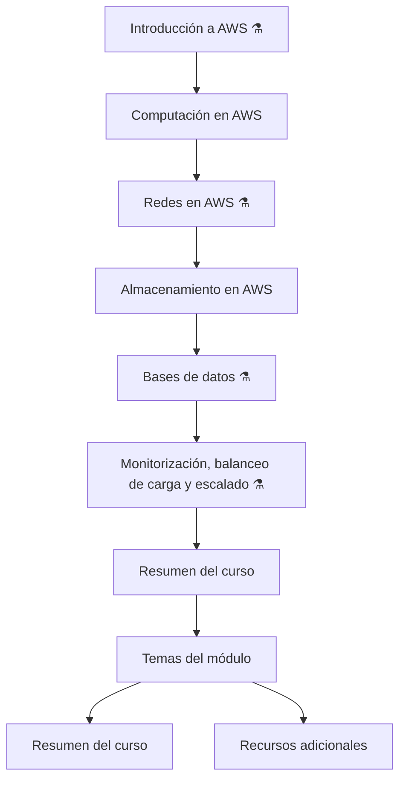

# Módulo 0: Descripción general del curso

<!-- markdownlint-disable MD033 -->

  
  

<!-- markdownlint-enable MD033 -->

## Mapa del curso

### Módulo 1: Introducción a Amazon Web Services

Este módulo presenta:

- Los conceptos fundamentales de la nube.
- Las ventajas de utilizar servicios en la nube.
- La infraestructura global de AWS.
- AWS Identity and Access Management (IAM)

---

### Módulo 2: Computación en AWS

Este módulo presenta los principales servicios de computación de AWS:

- Amazon Elastic Compute Cloud (Amazon EC2).
- AWS Fargate.
- AWS Lambda.
- Amazon Elastic Container Service (Amazon ECS).
- Amazon Elastic Kubernetes Service (Amazon EKS).

El módulo explica distintas formas de ejecutar aplicaciones y cargas de trabajo en AWS, desde instancias virtuales hasta contenedores y funciones sin servidor.

---

### Módulo 3: Redes en AWS

Este módulo se centra en Amazon Virtual Private Cloud (Amazon VPC).
También aborda otras tecnologías de red utilizadas para:

- Crear redes privadas en AWS.
- Proteger los recursos.
- Controlar la comunicación entre componentes.
- Conectar una red privada con los recursos de AWS.

---

### Módulo 4: Almacenamiento en AWS

Este módulo presenta diferentes soluciones de almacenamiento:

- Amazon Simple Storage Service (Amazon S3).
- Amazon Elastic Block Store (Amazon EBS).
- Amazon Elastic File System (Amazon EFS).
- Amazon FSx.
- Almacenamiento de instancias de Amazon EC2.

El módulo explica cómo seleccionar una solución de almacenamiento según las necesidades de la aplicación.

---

### Módulo 5: Bases de datos

Este módulo presenta varios casos de uso relacionados con servicios de base de datos, con especial atención a:

- Amazon Relational Database Service (Amazon RDS).
- Amazon DynamoDB.

---

### Módulo 6: Monitorización, balanceo de carga y escalado

Este módulo explica cómo monitorizar y escalar aplicaciones mediante:

- Amazon CloudWatch.
- Elastic Load Balancing (ELB).
- Amazon EC2 Auto Scaling.

Estos servicios permiten observar el comportamiento de las aplicaciones, distribuir el tráfico y adaptar la capacidad según la demanda.

---

### Módulo 7: Resumen del curso

El último módulo resume los principales conceptos tratados durante el curso, especialmente:

- Los servicios fundamentales de AWS.
- La relación entre computación, redes y almacenamiento.
- Las bases de datos.
- La monitorización.
- El balanceo de carga.
- El escalado.

*Los módulos que contienen este símbolo ⚗️ disponen de laboratorio práctico.*
