# Módulo 1: Introducción a Amazon Web Services

<!-- markdownlint-disable MD033 -->

  
  

<!-- markdownlint-enable MD033 -->

## Objetivos

En este módulo explorarás:

- La terminología y los conceptos relacionados con los productos y servicios de AWS.
- La consola de administración de AWS.
- Los conceptos fundamentales de seguridad de AWS.
- AWS Identity and Access Management (IAM).

---

## Computación en la nube

### ¿Qué es la computación en la nube?

La computación en la nube permite:

- Acceder a servicios bajo demanda.
- Proporcionar recursos informáticos según sea necesario.
- Pagar únicamente por lo que se utiliza.

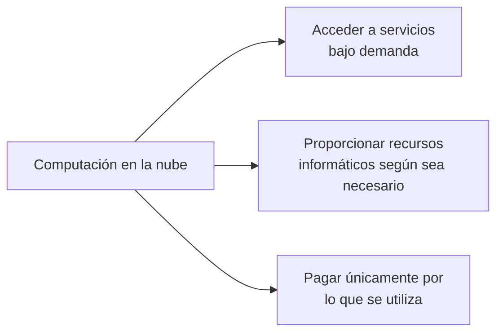

La nube permite utilizar recursos tecnológicos sin tener que adquirir y mantener toda la infraestructura física necesaria para ejecutarlos.

---

### Ventajas de la computación en la nube

La computación en la nube permite:

- Obtener ahorros de costes.
- Aumentar la velocidad y la agilidad.
- Llegar a todo el mundo en cuestión de minutos.

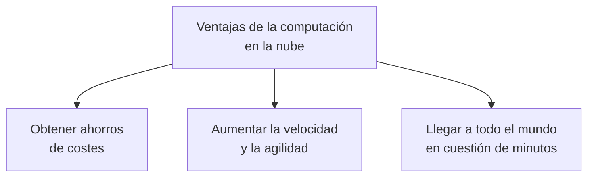

### Obtener ahorros de costes

La nube permite reducir la necesidad de realizar grandes inversiones en centros de datos, servidores y otros recursos físicos.

### Aumentar la velocidad y agilidad

Los recursos pueden aprovisionarse rápidamente. Esto permite experimentar, desarrollar y desplegar aplicaciones con mayor rapidez.

### Llegar a todo el mundo en cuestión de minutos

La infraestructura global de AWS permite desplegar aplicaciones y servicios en distintas ubicaciones geográficas de manera ágil.

---

### Amplitud de los servicios

AWS ofrece una amplia variedad de productos y servicios basados en la nube, entre ellos:

- Computación.
- Redes.
- Almacenamiento.
- Bases de datos.
- Analítica.
- Servicios de aplicaciones.
- Servicios de móviles.
- Herramientas para desarrolladores.
- Herramientas de gestión.
- Internet de las cosas (IoT).
- Seguridad.
- Identidad y cumplimiento.
- Aplicaciones empresariales.

Estos servicios ayudan a las organizaciones a avanzar con mayor rapidez, reducir los costes de tecnología de la información y escalar sus operaciones.
AWS se utiliza para ejecutar distintos tipos de cargas de trabajo, entre ellas:

- Aplicaciones web y móviles.
- Desarrollo de videojuegos.
- Procesamiento de datos.
- Almacenamiento y archivado.
- Almacenes de datos.

AWS también ofrece servicios relacionados con:

- Contenedores.
- Orquestación.
- Integración continua y entrega continua.
- Herramientas DevOps.
- Monitorización.
- Notificaciones.
- Colas de mensajes.
- Transcodificación.
- Búsqueda.
- Caching.
- Flujos de trabajo.
- Seguimiento del uso.

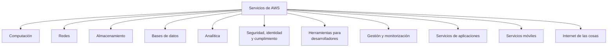

## AWS Global Infrastructure

AWS opera una infraestructura global que permite ejecutar aplicaciones y almacenar datos en distintas ubicaciones geográficas.

### Regiones de AWS

Las regiones de AWS son ubicaciones geográficas físicas de todo el mundo donde AWS aloja sus centros de datos.

Un región está formada por tres o más zonas de disponibilidad dentro de un área geográfica determinada.

Las regiones reciben su nombre según la ubicación en la que se encuentran. Por ejemplo:

- Una región en el Norte de Virginia.
- Una región en Oregón.

AWS dispone de regiones en:

- Norteamérica
- Sudamérica.
- Europa.
- China.
- Asia-Pacífico.
- África.
- Oriente Medio.

AWS continua ampliando su infraestructura para satisfacer las necesidades de sus clientes.
Cuando usas AWS, debes elegir una región para indicar donde se crearán y ejecutarán tus recursos.

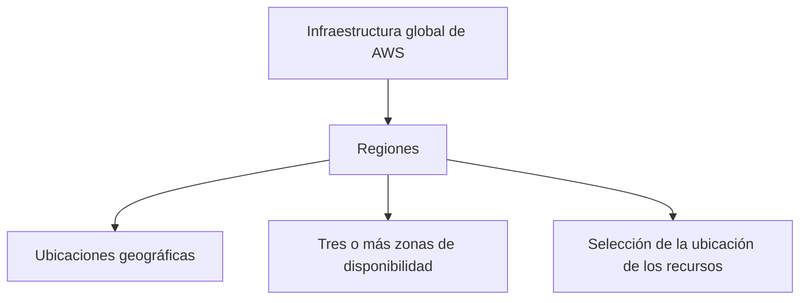

#### Selección de una región

Al seleccionar una región, debes tener en cuenta:

- **Latencia:** el tiempo que tardan los datos en desplazarse entre el usuario y el recurso.
- **Precio:** los precios pueden variar según la región.
- **Disponibilidad del servicio:** no todos los servicios están disponibles en todas las regiones.
- **Cumplimiento normativo de los datos:** algunos datos deben permanecer en ubicaciones geográficas concretas debido a requisitos legales o normativos.

---

### Zonas de disponibilidad

Una zona de disponibilidad, o **Availability Zone (AZ)**, está formada por uno o más centros de datos con:

- Alimentación eléctrica redundante.
- Redes redundantes.
- Conectividad redundante.

Las zonas de disponibilidad permiten ejecutar aplicaciones y bases de datos que sean:

- Altamente disponibles
- Tolerantes a errores.
- Escalables.

Aunque las zonas de disponibilidad están lo bastante cerca como para ofrecer una latencia reducida, no se construyen directamente unas junto a otras.

La **latencia** es el tiempo que transcurre entre el momento en que se solicita contenido y en el momento en que se recibe.

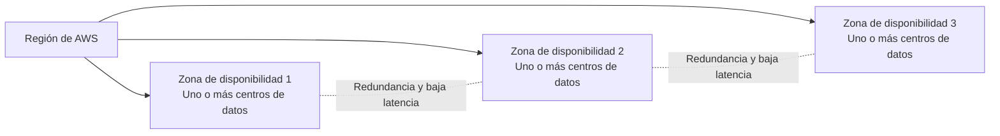

### Ubicaciones de borde

Las ubicaciones de borde son ubicaciones globales donde se almacena contenido en caché.

Por ejemplo, si el contenido multimedia se encuentra en Londres y quieres compartir archivos de vídeo con clientes de Tokio, los vídeos podrían almacenarse en caché en una ubicación de borde cercana a Tokio.

De este modo, los clientes podrían acceder al contenido almacenado en caché más rápidamente que si tuvieran que obtenerlo directamente desde Londres.

AWS dispone actualmente de más de 400 ubicaciones de borde en todo el mundo, según el material del curso.

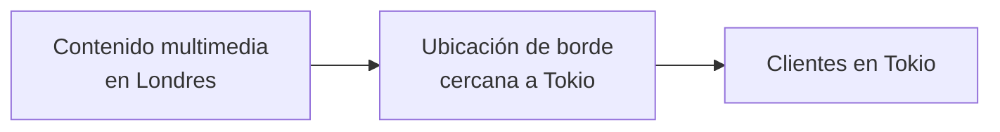

## Gestión de los servicios de AWS

Los servicios de AWS pueden administrarse utilizando distintas herramientas.

### AWS Management Console

La AWS Management Console es una interfaz web que permite acceder y administrar los servicios y recursos de AWS.

Desde la consola puedes:

- Buscar servicios de AWS.
- Crear y configurar recursos.
- Consultar el estado de los recursos.
- Administrar usuarios y permisos.
- Configurar servicios mediante formularios y menús.
- Supervisor los recursos y revisar información de uso.

La consola proporciona una forma visual de trabajar en AWS, sin necesidad de escribir comandos ni desarrollar código.

### Interfaz de línea de comandos

La **AWS Command Line Interface (AWS CLI)** permite interactuar con los servicios de AWS mediante comandos escritos en un terminal.

### Kits de desarrollo de software

Los **Software Development Kits (SDKs)** permiten utilizar los servicios de AWS desde aplicaciones desarrolladas en distintos lenguajes de programación.

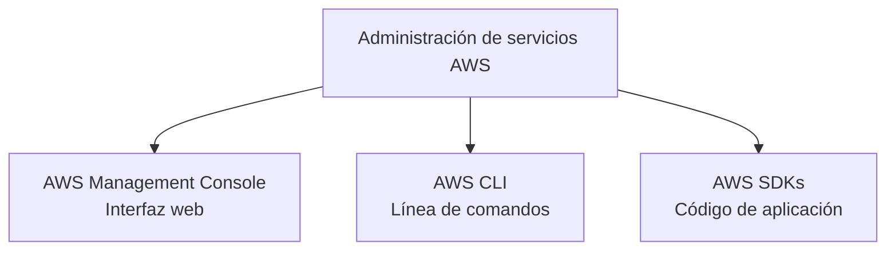

### Modelo de responsabilidad compartida de AWS

Cuando un cliente utiliza servicios de AWS, la seguridad es responsabilidad tanto de AWS como del cliente.

La responsabilidad se divide en dos áreas:

- **Seguridad de la nube:** responsabilidad de AWS.
- **Seguridad en la nube:** responsabilidad del cliente.

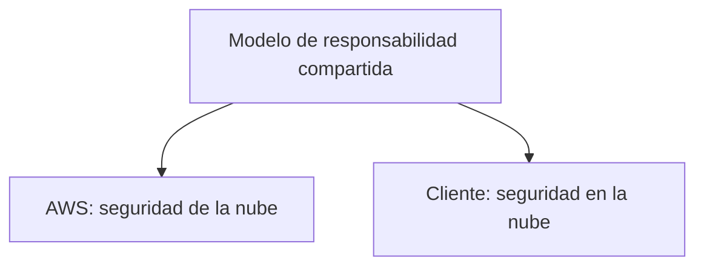

#### AWS: seguridad de la nube

AWS es el responsable de proteger la infraestructura que ejecuta todos los servicios ofrecidos en AWS Cloud.

Entre las responsabilidades de AWS se incluyen:

- La seguridad física de los centros de datos.
- La infraestructura de red.
- La infraestructura de hardware y software.
- La infraestructura de virtualización.
- La seguridad de las regiones.
- La seguridad de las zonas de disponibilidad.
- La seguridad física de los edificios.

AWS administra los componentes de hardware y de red que ejecutan sus servicios, entre ellos:

- Servidores físicos.
- Sistemas operativos del host.
- Capas de virtualización.
- Componentes de red de AWS.

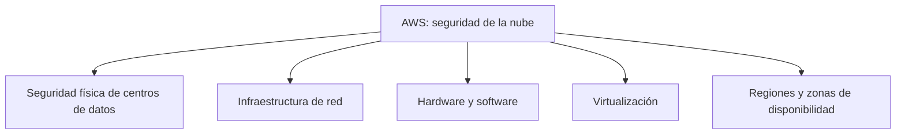

La responsabilidad de AWS varía según el servicio utilizado.

Por ejemplo:

- En servicios de computación como **Amazon EC2**, AWS administra la infraestructura subyacente y los servicios fundamentales.
- En servicios que requieren poca administración por parte del cliente, como **Amazon S3**, AWS opera la infraestructura, el sistema operativo y las plataformas. AWS también se encarga del cifrado del lado del servidor y de la protección de los datos correspondiente a esa infraestructura.

#### Cliente: seguridad en la nube

El cliente es responsable de la seguridad dentro de la nube.

Esto significa que el cliente debe:

- Configurar correctamente los servicios de AWS.
- Configurar correctamente sus aplicaciones.
- Proteger sus datos.
- Gestionar el acceso a sus recursos.
- Administrar los sistemas operativos cuando corresponda.
- Gestionar las cuentas.
- Administrar el cifrado del lado del cliente.
- Administrar la integridad y protección de sus datos.

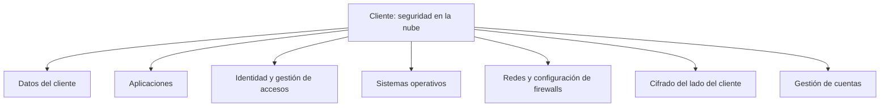

El nivel de responsabilidad del cliente depende del servicio utilizado.

Algunos servicios requieren que el cliente realice muchas tareas de configuración y administración. Otros servicios, más abstractos, solo requieren que el cliente gestione los datos y controle el acceso a los recursos.

##### Ejemplo: Amazon EC2

Cuando se utiliza Amazon EC2, el cliente es responsable de:

- El sistema operativo.
- La plataforma de la aplicación.
- El cifrado de los datos.
- La protección de los datos.
- La gestión de los datos del cliente.

AWS es responsable de la infraestructura subyacente sobre la que se ejecuta la instancia.

##### Ejemplo: Amazon S3

Cuando se utiliza Amazon S3, el cliente es responsable principalmente de:

- Gestionar los datos del cliente.
- Proteger los datos mediante el cifrado del lado del cliente.
- Controlar quién puede acceder a los recursos.

AWS administra la infraestructura, el sistema operativo, la plataforma y otros componentes subyacentes del servicio.

#### Analogía del edificio

El modelo puede compararse con una empresa de construcción que edifica un edificio y se asegura que sea estable y seguro.

Cuando el edificio está terminado, puedes alquilar un apartamento en uno de sus pisos. Como inquilino, eres responsable de cerrar la puerta del apartamento para proteger tus pertenencias.

En esta analogía:

- **AWS** es la empresa constructora.
- **El cliente** es el inquilino.
- **El edificio y su estructura** representan la infraestructura de AWS.
- **La puerta y las pertenencias del apartamento** representan las aplicaciones, los datos y los permisos del cliente.

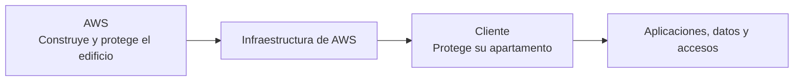

### Resumen

La seguridad en AWS es una responsabilidad compartida:

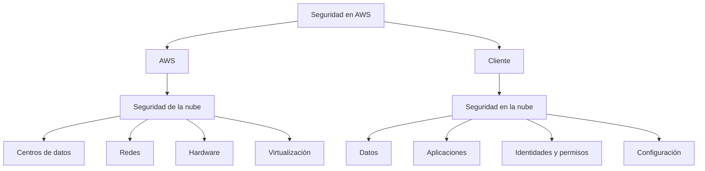

La responsabilidad exacta de cada parte depende del servicio de AWS utilizado. Cuanto más gestionado sea el servicio por AWS, más tareas de infraestructura asumirá AWS y más se centrará el cliente en sus datos, configuraciones y permisos.

---

## AWS Identity and Access Management (IAM)

AWS Identity and Access Management (IAM) es un servicio web que permite gestionar de forma segura el acceso a las cuentas y los recursos de AWS.

Con IAM puedes crear y administrar:

- Usuarios de AWS.
- Aplicaciones.
- Servicios conectados.
- Permisos.
- Políticas de acceso.

IAM permite controlar quién puede acceder a los recursos de AWS y qué acciones puede realizar sobre ellos.

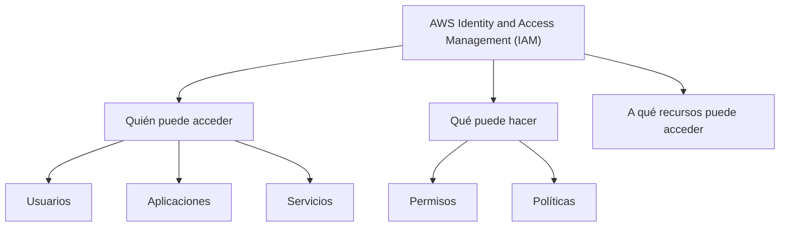

### Características de IAM

Entre las características principales de IAM se incluyen:

- Control detallado de los permisos.
- Integración con políticas.
- Autenticación multifactor (MFA).
- Uso global dentro de una cuenta de AWS.
- Disponibilidad sin coste adicional.

IAM permite definir permisos específicos para usuarios, aplicaciones y servicios.

---

### Usuario raíz de AWS

Cuando creas una cuenta de AWS, comienzas con una única identidad de inicio de sesión que tiene acceso completo a todos los servicios y recursos de la cuenta.

Esta identidad se denomina **usuario raíz de AWS**.

El usuario raíz se obtiene iniciando sesión con:

- La dirección de correo electrónico utilizada para crear la cuenta.
- La contraseña utilizada para crear la cuenta.

#### Credenciales del usuario raíz

Las credenciales asociadas al usuario raíz son:

##### Nombre de usuario y contraseña

Permiten acceder a la AWS Management Console.

##### Claves de acceso

Las claves de acceso están formadas por:

- Un ID de clave de acceso.
- Una clave de acceso secreta.

Permiten realizar solicitudes programáticas mediante:

- AWS CLI.
- AWS SDKs.
- Otras herramientas compatibles.

Al igual que una combinación de nombre de usuario y contraseña, para autenticar solicitudes programáticas se necesitas tanto el ID de la clave de acceso como la clave de acceso secreta.

Las claves de acceso deben protegerse con el mismo nivel de seguridad que una dirección de correo y una contraseña.

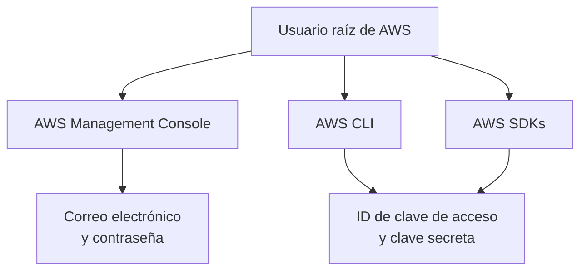

#### Buenas prácticas para el usuario raíz

Para proteger el usuario raíz:

- Utiliza una contraseña segura.
- Activa la autenticación multifactor (MFA).
- No compartas nunca la contraseña del usuario raíz.
- No compartas nunca las claves de acceso asociadas al usuario raíz.
- Desactiva o elimina las claves de acceso asociadas al usuario raíz.
- Crea un usuario de IAM para las tareas administrativas y cotidianas.
- Limita las tareas realizadas con el usuario raíz.

El usuario raíz debe utilizarse únicamente para las tareas que requieren específicamente sus privilegios.

#### Secuencia recomendada

1. Crea una cuenta de AWS con una contraseña segura.
2. Esto establece la identidad del usuario raíz.
3. Crea tu primer usuario de IAM.
4. Concédele permisos para crear otros usuarios.
5. Utiliza el usuario de IAM para las tareas administrativas y cotidianas.
6. Reserva el usuario raíz para las tareas que lo requieran.

---

### Autenticación multifactor

Iniciar sesión en una cuenta de AWS utilizando únicamente un nombre de usuario y una contraseña se considera autenticación de un solo factor.

La autenticación de un solo factor es el método más sencillo y habitual, pero la cuenta continúa estando en riesgo si alguien descubre la contraseña.

Por ejemplo, un atacante podría obtenerla mediante:

- Ingeniería social.
- Bots.
- Scripts.
- Otros métodos de ataque.

Si un atacante consigue la contraseña, podría:

- Acceder a la cuenta.
- Eliminar datos importantes.
- Crear recursos costosos.
- Ejecutar operaciones de minería de criptomonedas.
- Generar cargos económicos para el propietarios de la cuenta.

#### MFA

La autenticación multifactor, o Multi-Factor Authentication (MFA), añade una capa adicional de seguridad.

Con MFA, aunque alguien conozca el nombre de usuario y la contraseña, no podrá acceder a la cuenta sin introducir también un código generado por dispositivo MFA virtual o físico.

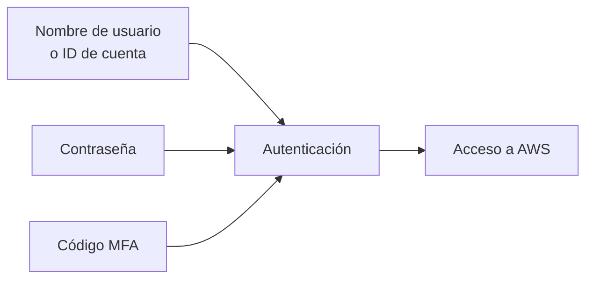

AWS recomienda activar MFA inmediatamente después de crear una cuenta de AWS.

---

### Usuarios de IAM

Un usuario de IAM es una identidad que representa a una persona o una aplicación que interactúa con servicios y recursos de AWS.

Un usuarios de IAM puede tener permisos específicos para realizar determinadas acciones sobre determinados recursos.

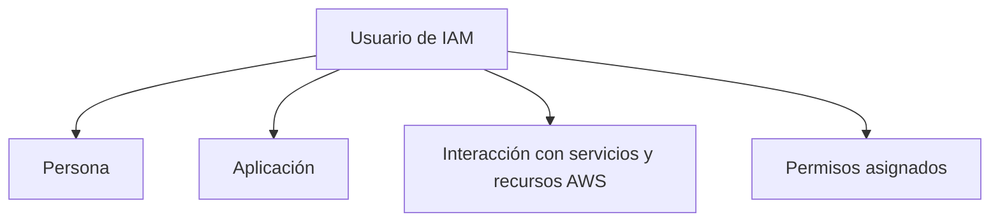

Como buena práctica, se recomienda exigir autenticación multifactor (MFA) para los usuarios de IAM.
