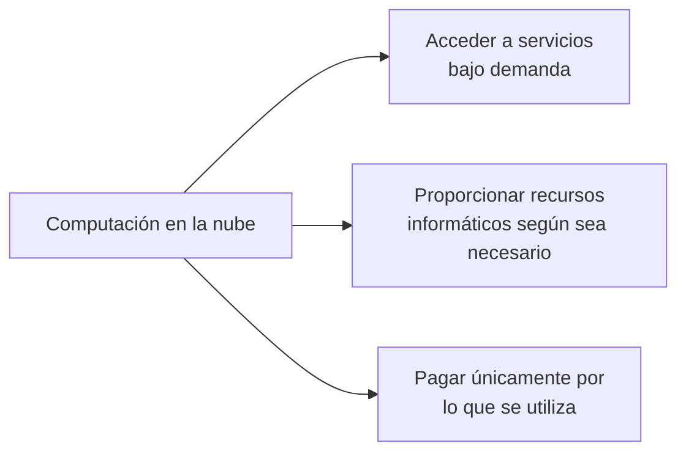
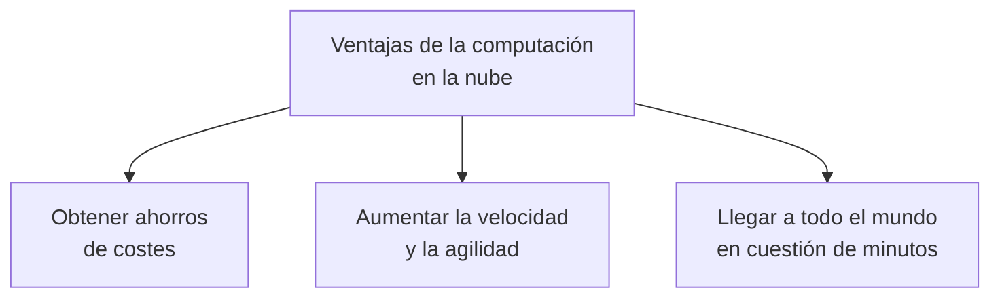
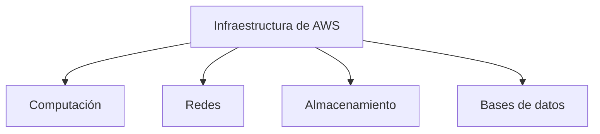
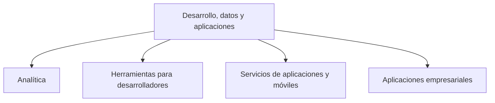
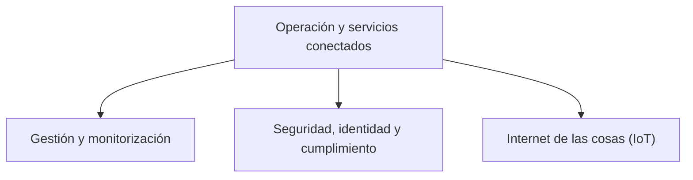

# Módulo 1: Introducción a Amazon Web Services

## Objetivos

En este módulo explorarás:

- La terminología y los conceptos relacionados con los productos y servicios de AWS.
- La consola de administración de AWS.
- Los conceptos fundamentales de seguridad de AWS.
- AWS Identity and Access Management (IAM).

---

## Computación en la nube

### ¿Qué es la computación en la nube?

La computación en la nube permite:

- Acceder a servicios bajo demanda.
- Proporcionar recursos informáticos según sea necesario.
- Pagar únicamente por lo que se utiliza.

La nube permite utilizar recursos tecnológicos sin tener que adquirir y mantener toda la infraestructura física necesaria para ejecutarlos.

---

### Ventajas de la computación en la nube

La computación en la nube permite:

- Obtener ahorros de costes.
- Aumentar la velocidad y la agilidad.
- Llegar a todo el mundo en cuestión de minutos.

### Obtener ahorros de costes

La nube permite reducir la necesidad de realizar grandes inversiones en centros de datos, servidores y otros recursos físicos.

### Aumentar la velocidad y agilidad

Los recursos pueden aprovisionarse rápidamente. Esto permite experimentar, desarrollar y desplegar aplicaciones con mayor rapidez.

### Llegar a todo el mundo en cuestión de minutos

La infraestructura global de AWS permite desplegar aplicaciones y servicios en distintas ubicaciones geográficas de manera ágil.

---

### Amplitud de los servicios

AWS ofrece una amplia variedad de productos y servicios basados en la nube, entre ellos:

- Computación.
- Redes.
- Almacenamiento.
- Bases de datos.
- Analítica.
- Servicios de aplicaciones.
- Servicios de móviles.
- Herramientas para desarrolladores.
- Herramientas de gestión.
- Internet de las cosas (IoT).
- Seguridad.
- Identidad y cumplimiento.
- Aplicaciones empresariales.

Estos servicios ayudan a las organizaciones a avanzar con mayor rapidez, reducir los costes de tecnología de la información y escalar sus operaciones.
AWS se utiliza para ejecutar distintos tipos de cargas de trabajo, entre ellas:

- Aplicaciones web y móviles.
- Desarrollo de videojuegos.
- Procesamiento de datos.
- Almacenamiento y archivado.
- Almacenes de datos.

AWS también ofrece servicios relacionados con:

- Contenedores.
- Orquestación.
- Integración continua y entrega continua.
- Herramientas DevOps.
- Monitorización.
- Notificaciones.
- Colas de mensajes.
- Transcodificación.
- Búsqueda.
- Caching.
- Flujos de trabajo.
- Seguimiento del uso.

#### Infraestructura fundamental

#### Desarrollo, datos y aplicaciones

#### Gestión, seguridad y servicios conectados

